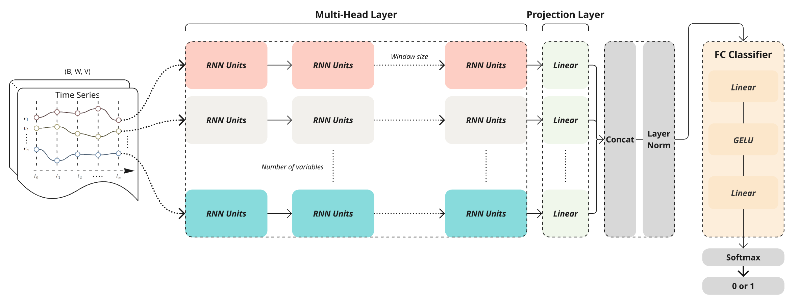

# Table of Contents

1. [Introduction](#Introduction)
2. [Architecture Overview](#Architecture-Overview)
3. [Getting Started](#Getting-Started)
   * Check the Running Environment
   * Installation and Dependencies
   * Download Datasets
   * Configuration
   * Training the Model


---


# 📑Introduction

## Multi-Head Recurrent Neural Networks for Financial Time Series Classification

This repository implements a multi-head architecture for bankruptcy prediction on financial time series. It uses recurrent models—LTC, CfC, LSTM, GRU and RNN—to process multiple financial indicators in parallel, and includes various preprocessing techniques, undersampling methods to address class imbalance, and comprehensive evaluation metrics.


---


# 🔍Architecture Overview

## Multi-Head Architecture

<div align="center">
   
</div>


The architecture employs a multi-head design where each financial variable is processed through its own dedicated network branch, with outputs subsequently combined for final classification.

> **Note:** Papers are [here](https://www.mdpi.com/1999-5903/16/3/79).

### Liquid Time-Constant Networks (LTC)

Continuous-time recurrent network with liquid time constants.
* **Paper:** [https://arxiv.org/pdf/2006.04439](https://arxiv.org/pdf/2006.04439)

### Closed-form Continuous-time Networks (CfC)

Efficient continuous-time networks with closed-form solutions.
* **Paper:** [https://arxiv.org/pdf/2106.13898](https://arxiv.org/pdf/2106.13898)


### Recurrent Neural Network (RNN)

### Long Short-Term Memory (LSTM)

### Gated Recurrent Unit (GRU)


---


# 🔨Getting Started

## 1. Check the Running Environment

Verify your PyTorch installation:

```bash
python -c "import torch; print(torch.__version__); print('CUDA available:', torch.cuda.is_available())"
```

## 2. Installation and Dependencies

Clone the repository and install dependencies:

```bash
pip install -r requirements.txt
```

### Required Dependencies

 * torch
 * pandas
 * matplotlib
 * scikit-learn
 * ncps
 * rich
 * pyyaml
 * hydra-core

## 3. Download Datasets

```bash
https://github.com/sowide/multi-head_LSTM_for_bankruptcy-prediction
```

## 4. Configuration

Modify `./config/config.yaml` to customize your experiment.

## 5. Training the Model

### Data Preparation

Ensure your dataset is structured as:

```
./dataset/{window}_train.csv
./dataset/{window}_valid.csv
./dataset/{window}_test.csv
```

exam:
```
./dataset/3_test.csv
./dataset/3_train.csv
./dataset/3_valid.csv
   ...
```

### Running Training

```bash
python main.py
```

### Results

* Model checkpoints: `result/best_model.pth`
* Experimental results: `./result/scaler/"model"_"rnn hidden size"_"projection size"_"fc hidden size"_"threshold"`
* Show plots: `python plot.py`

> **Note:** To view the plot, place the CSV file in the `./plot` folder.

